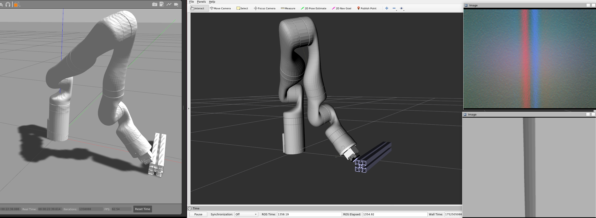

# Kinova & Gelsight Visual Servoing for Edge Tracking

This repository contains code and configuration files for simulate a edge tracking using visual servoing with a Kinova Gen3 robotic arm and a Gelsight Mini tactile sensor.  

The system enables the end-effector to follow object contours by combining visual-tactile perception and reactive control.



## Docker installation and setup (Dev Container)

- Clone the repository:

```bash
git clone https://github.com/EPVelasco/gs_kinova_devcontainer.git

```

- Open the folder in Visual Studio Code.
```bash
cd gs_kinova_devcontainer
code .
```

- When prompted with Reopen in Container, click "**Reopen in Container**".

⚙️ If the prompt does not appear, open the command palette (**Ctrl + Shift + P**) and select:

```
makefile
Remote-Containers: Reopen in Container
```
VSCode will build the container using the .devcontainer/devcontainer.json configuration, which sets up ROS Noetic and all required dependencies.

## Launching the simulator

### Start the container

Open a terminal inside VSCode (running inside the Dev Container), and run:

```bash
source /opt/ros/noetic/setup.bash
catkin_make 
source devel/setup.bash
```
This will compile the workspace and prepare the environment.


## Launching the simulator

To start the simulation environment, use the following command inside the Dev Container terminal:

```bash
roslaunch kortex_gazebo spawn_gs_Kinova.launch start_rviz:=true use_trajectory_controller:=false gs_sim:=true object_name:="aluminum_profile" rviz_config:="test_02.rviz" 
````

To launch a shoe simulation, you need set the RPY angles for the stl:

```bash
roslaunch kortex_gazebo spawn_gs_Kinova.launch start_rviz:=true use_trajectory_controller:=false gs_sim:=true object_name:="shoe" x:=0.50 y:=0.0 z:=0.0582 roll:=0.012055 pitch:=0.035225 yall:=0.0
````

To launch a free body gelsight sensor
```bash
roslaunch gelsight_gazebo start_gazebo_gs.launch
````

This command will:

* Launch **Gazebo** and spawn the Kinova robot.
* Launch **RViz** for visualization (`start_rviz:=true`).
* Disable the default trajectory controller (`use_trajectory_controller:=false`) so the robot can be controlled directly by the visual servoing node.
* Enable the Gelsight simulation mode (`gs_sim:=true`).

### `object_name` option

The `object_name` argument specifies which object to spawn in front of the robot for edge tracking. You can choose:

* `"aluminum_profile"` — a long aluminum edge profile, useful for straight edge tracking.
* `"curve1"` 
* `"curve2"` 

---

Once the environment is launched, you can run your visual servoing node

```
roslaunch ToDo.launch
```

## GPU errors

If you have problems with Nvidia dependencies, or if you don't have a physical GPU, you can create your container without the NVIDIA flags. The `devcontainer_w-o_GPU.json` file has instructions for creating the container. Just replace the contents of the original `devcontainer.json` file with `devcontainer_w-o_GPU.json`.